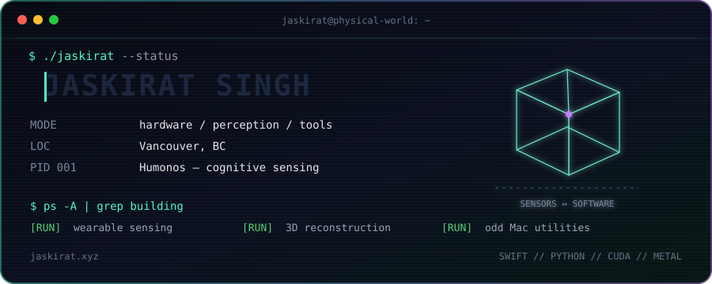

  

  <strong>I build systems that connect the physical world to software.</strong> 
  Wearables · spatial computing · computer vision · developer tools

  <a href="https://jaskirat.xyz">website</a> ·
  <a href="https://humonos.com">building Humonos</a> ·
  <a href="https://github.com/jaskirat1616?tab=repositories">all projects</a>

I’m Jaskirat, a builder in Vancouver. I work where hardware meets intelligence: wearable sensing, real-time spatial systems, accessibility tools, and the developer infrastructure underneath them.

Right now I’m building **[Humonos](https://humonos.com)**, a wearable system for measuring cognitive state outside the lab. Away from the keyboard, I organize hands-on build days and AI events around Vancouver.

### Selected work

<table>
  <tr>
    <td width="50%" valign="top">
      <h3><a href="https://github.com/jaskirat1616/mactap-app">⌁ MacTap</a></h3>
      Knock your MacBook to run shortcuts. A tiny physical interaction turned into a useful macOS tool.  
      <code>Swift</code> <code>Core Motion</code> <code>macOS</code>
    </td>
    <td width="50%" valign="top">
      <h3><a href="https://github.com/jaskirat1616/Splatline">◈ Splatline</a></h3>
      Turn ordinary video and photos into explorable 3D scenes with modern Gaussian splatting backends.  
      <code>Python</code> <code>3D Vision</code> <code>Gaussian Splatting</code>
    </td>
  </tr>
  <tr>
    <td width="50%" valign="top">
      <h3><a href="https://github.com/jaskirat1616/Arvos">⌁ Arvos</a></h3>
      Stream an iPhone’s LiDAR, camera, IMU, GPS, and other sensors to any computer in real time.  
      <code>Swift</code> <code>ARKit</code> <code>WebSocket</code>
    </td>
    <td width="50%" valign="top">
      <h3><a href="https://github.com/jaskirat1616/AirPoise">◌ AirPoise</a></h3>
      Private, on-device posture coaching and head-gesture shortcuts using only your AirPods.  
      <code>Swift</code> <code>AirPods</code> <code>Core Motion</code>
    </td>
  </tr>
  <tr>
    <td width="50%" valign="top">
      <h3><a href="https://github.com/jaskirat1616/fusion360-mcp">⌘ Fusion 360 MCP</a></h3>
      Give AI agents a practical interface for creating and editing designs inside Autodesk Fusion 360.  
      <code>Python</code> <code>MCP</code> <code>CAD</code>
    </td>
    <td width="50%" valign="top">
      <h3><a href="https://github.com/jaskirat1616/GaussCam">◎ GaussCam</a></h3>
      Real-time monocular Gaussian splatting on NVIDIA GPUs and Apple Silicon.  
      <code>Python</code> <code>CUDA</code> <code>Metal</code>
    </td>
  </tr>
</table>

### Play: Signal Runner

Collect all three signal nodes (`*`), then reach the uplink (`X`). Your position is `@`. Each control opens a tiny move request; submit it and the board updates automatically.

  
    
  <a href="https://github.com/jaskirat1616/jaskirat1616/issues/new?title=ascii-game%3Aup&body=Submit+this+issue+to+move+up.+The+game+will+close+it+automatically.">▲ up</a>
  &nbsp;&nbsp;
  <a href="https://github.com/jaskirat1616/jaskirat1616/issues/new?title=ascii-game%3Aleft&body=Submit+this+issue+to+move+left.+The+game+will+close+it+automatically.">◀ left</a>
  &nbsp;&nbsp;
  <a href="https://github.com/jaskirat1616/jaskirat1616/issues/new?title=ascii-game%3Adown&body=Submit+this+issue+to+move+down.+The+game+will+close+it+automatically.">▼ down</a>
  &nbsp;&nbsp;
  <a href="https://github.com/jaskirat1616/jaskirat1616/issues/new?title=ascii-game%3Aright&body=Submit+this+issue+to+move+right.+The+game+will+close+it+automatically.">▶ right</a>
  &nbsp;&nbsp;·&nbsp;&nbsp;
  <a href="https://github.com/jaskirat1616/jaskirat1616/issues/new?title=ascii-game%3Arestart&body=Submit+this+issue+to+reset+the+board.">↻ restart</a>

  Building things that work… eventually. · <a href="https://jaskirat.xyz">jaskirat.xyz</a>

