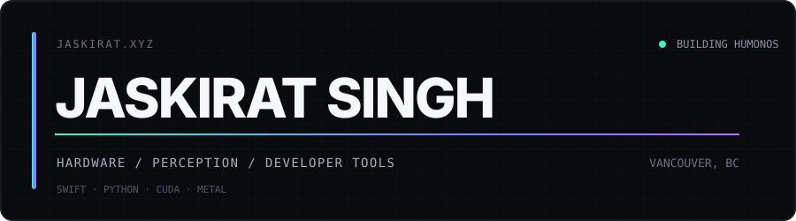
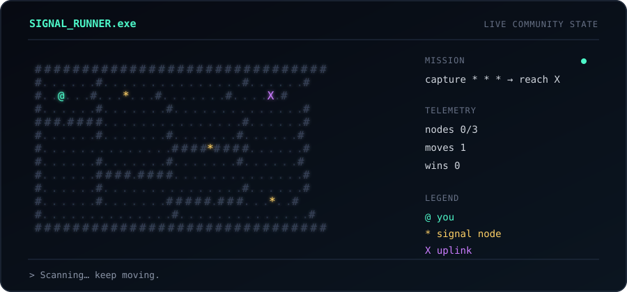

  
   
  <code>hardware</code> · <code>perception</code> · <code>developer tools</code> · <code>macOS</code>
    
  <a href="https://jaskirat.xyz">jaskirat.xyz</a> / <a href="https://humonos.com">Humonos</a> / <a href="https://github.com/jaskirat1616?tab=repositories">41 repos</a>

I make sensing systems, computer-vision tools, and strange Mac utilities. Currently building **[Humonos](https://humonos.com)** in Vancouver.

### `~/shipped`

<table>
  <tr>
    <td width="50%" valign="top">
      <h3><a href="https://github.com/jaskirat1616/mactap-app">⌁ MacTap</a></h3>
      Knock a MacBook to run shortcuts.  
      <code>Swift</code> <code>Core Motion</code> <code>macOS</code>
    </td>
    <td width="50%" valign="top">
      <h3><a href="https://github.com/jaskirat1616/Splatline">◈ Splatline</a></h3>
      Video or photos in. Interactive Gaussian splat out.  
      <code>Python</code> <code>3D Vision</code> <code>CUDA</code>
    </td>
  </tr>
  <tr>
    <td width="50%" valign="top">
      <h3><a href="https://github.com/jaskirat1616/Arvos">⌁ Arvos</a></h3>
      Stream iPhone LiDAR, camera, IMU, and GPS to any computer.  
      <code>Swift</code> <code>ARKit</code> <code>WebSocket</code>
    </td>
    <td width="50%" valign="top">
      <h3><a href="https://github.com/jaskirat1616/AirPoise">◌ AirPoise</a></h3>
      AirPods posture coaching and head-gesture shortcuts. On-device.  
      <code>Swift</code> <code>AirPods</code> <code>Core Motion</code>
    </td>
  </tr>
  <tr>
    <td width="50%" valign="top">
      <h3><a href="https://github.com/jaskirat1616/fusion360-mcp">⌘ Fusion 360 MCP</a></h3>
      Let agents build and edit CAD models inside Fusion 360.  
      <code>Python</code> <code>MCP</code> <code>CAD</code>
    </td>
    <td width="50%" valign="top">
      <h3><a href="https://github.com/jaskirat1616/GaussCam">◎ GaussCam</a></h3>
      Real-time monocular Gaussian splatting on NVIDIA and Apple Silicon.  
      <code>Python</code> <code>CUDA</code> <code>MPS</code>
    </td>
  </tr>
</table>

`+` **[eye-atlas](https://github.com/jaskirat1616/eye-atlas)** — interactive 3D human eye · **[XiaoJuice](https://github.com/jaskirat1616/XiaoJuice)** — BLE continuity experiments · **[Arvos SDK](https://github.com/jaskirat1616/Arvos-sdk)** — Python sensor client · **[grok-skills](https://github.com/jaskirat1616/grok-skills)** — 195 agent playbooks

### `~/commits --isometric`

  

Rendered nightly with <a href="https://github.com/lowlighter/metrics">lowlighter/metrics</a>.

### `~/signal_runner`

Collect `* * *`, then reach `X`. You are `@`. Runs in the browser with arrow keys, WASD, or touch controls.

  
    
  <strong><a href="https://jaskirat1616.github.io/jaskirat1616/">▶ PLAY SIGNAL RUNNER</a></strong>

